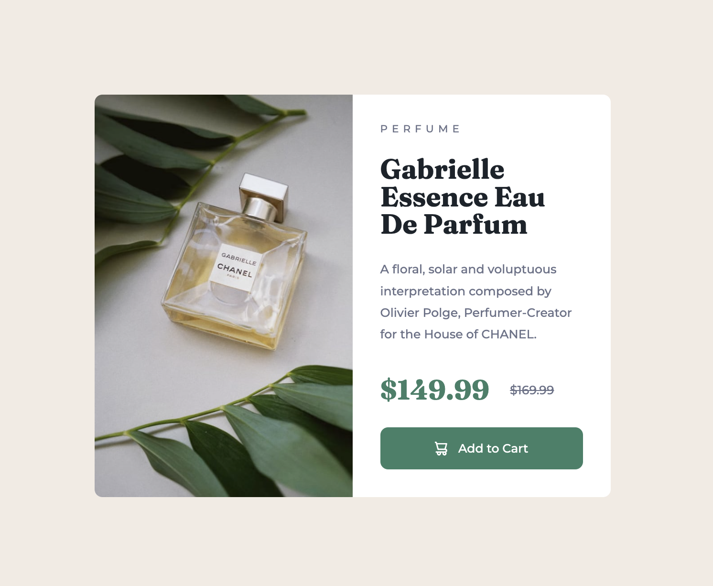

# Frontend Mentor - Product preview card component solution

This is a solution to the [Product preview card component challenge on Frontend Mentor](https://www.frontendmentor.io/challenges/product-preview-card-component-GO7UmttRfa). Frontend Mentor challenges help you improve your coding skills by building realistic projects.

## Table of contents

- [Overview](#overview)
  - [The challenge](#the-challenge)
  - [Screenshot](#screenshot)
  - [Links](#links)
- [My process](#my-process)
  - [Built with](#built-with)
  - [What I learned](#what-i-learned)
  - [Continued development](#continued-development)
- [Author](#author)
- [Acknowledgments](#acknowledgments)

## Overview

### The challenge

Users should be able to:

- View the optimal layout depending on their device's screen size
- See hover and focus states for interactive elements

### Screenshot

### Links

- Solution URL: [(https://github.com/YusufAkilevi/Product-Preview-Card-Component--FrontendMentor-)](https://your-solution-url.com)
- Live Site URL: [(https://yusufakilevi.github.io/Product-Preview-Card-Component--FrontendMentor-/)](https://your-live-site-url.com)

## My process

I built desktop version first and then went into the mobile version of the website.

### Built with

- Semantic HTML5 markup
- CSS custom properties
- Flexbox
- CSS Grid
- Desktop-first workflow

### What I learned

First, I design the html structure to use it to build the layout by Flexbox and CSS Grid. Then, I practiced Flexbox and CSS Grid to create the layout of the page.
I tried to stick to the design as much as possible. And also, I used media queries to respond mobile devices.

### Continued development

I want to continue to practice building layouts using Flexbox and CSS Grid with proper HTML structure and also work on responsive web design.

## Author

- Github - [@YusufAkilevi](https://github.com/YusufAkilevi)
- Frontend Mentor - [@YusufAkilevi](https://www.frontendmentor.io/profile/YusufAkilevi)

## Acknowledgments

In this small project, I worked alone but in the future I would like to work on open source projects with a group of people.
